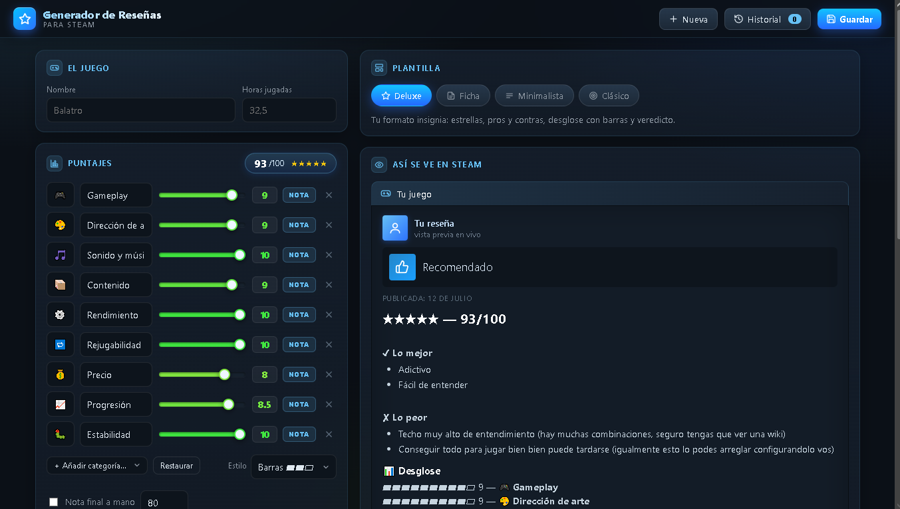

# Generador de Reseñas para Steam

Una app web local, en un solo archivo HTML, para escribir reseñas de Steam con estilo propio y exportarlas en **BBCode** listo para pegar. Sin instalaciones, sin cuentas, sin conexión: se abre con doble clic y todos tus datos quedan en tu navegador.

> **Probalo online:** https://santiagogonzalezgiberto-star.github.io/generador-resenas-steam/

## Qué hace

- **Bilingüe:** interfaz y reseñas en **español o inglés**, con un toggle ES/EN.
- **4 plantillas** con distinta personalidad: Deluxe, Ficha, Minimalista y Clásico.
- **Puntajes con sliders** por categoría, con promedio automático a una nota sobre 100.
- Categorías en dos modos: **nota** (suma al promedio) o **info** (dato con texto libre, no suma).
- **Pros y contras**, frase de apertura, veredicto, consejo y recomendación.
- **Vista previa en vivo** de cómo se va a ver la reseña en Steam.
- **Historial** de reseñas guardadas, con exportar / importar como backup `.json`.
- Contador de caracteres con el límite de 8.000 de Steam.

## Cómo usarlo

**En tu compu (local):** descargá el archivo `index.html` y abrilo con doble clic. Funciona en cualquier navegador moderno, incluso sin internet.

**Online:** una vez publicado con GitHub Pages, entrá al link de arriba desde cualquier dispositivo.

Cuando termines una reseña: completá el formulario, elegí una plantilla, tocá **Copiar** y pegá el BBCode en Steam (página del juego → «Escribir una reseña»).

## Privacidad

No hay servidor ni base de datos. Tus reseñas se guardan **solo en tu navegador** (localStorage). Si limpiás los datos del navegador, usá el botón **Exportar** del historial para tener un backup.

## Tecnología

HTML, CSS y JavaScript puro. Un único archivo, cero dependencias.

## Licencia

[MIT](LICENSE) — usalo, copialo y modificalo libremente.
